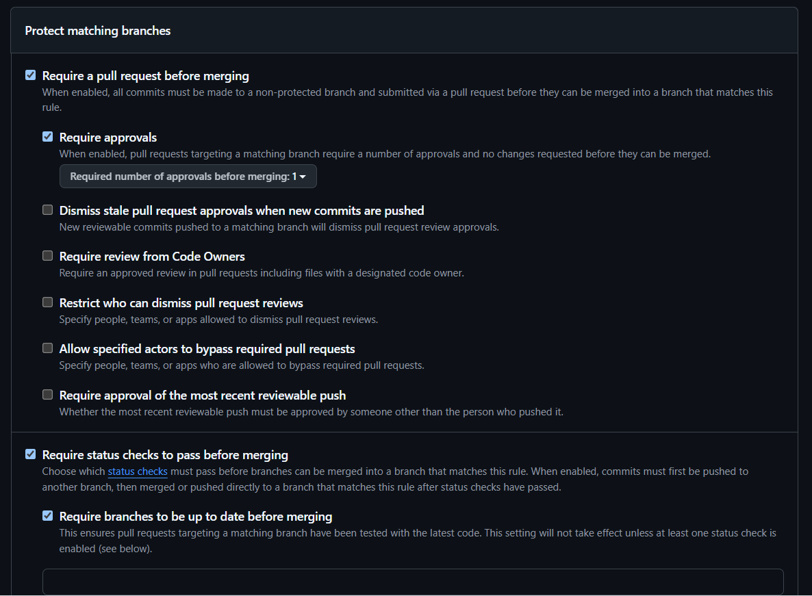
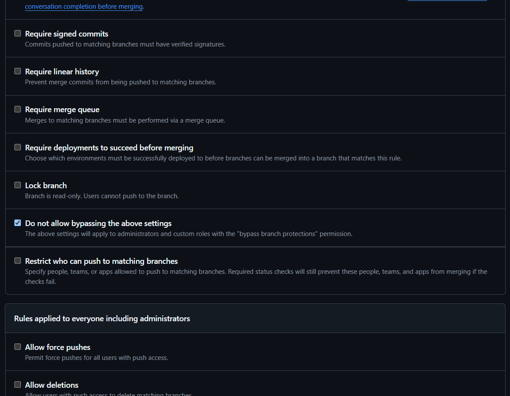

# Evidência de Proteção da Branch Main

## 1. Configuração da Regra de Proteção

## 2. Mensagem de Erro (Tentativa de Push Direto)

2026-09-18 22:40:26.878 [info] remote: error: GH006: Protected branch update failed for refs/heads/main.        
remote: 
remote: - Changes must be made through a pull request.        
To https://github.com/apda-agil/g1126-template-prato-cheio.git
 ! [remote rejected] main -> main (protected branch hook declined)
error: failed to push some refs to 'https://github.com/apda-agil/g1126-template-prato-cheio.git'

## 3. Informações de Configuração

* **Responsável por ativar a regra:** João Bagatoli
* **Data e Hora da ativação:** 18/09/2026 22:00
